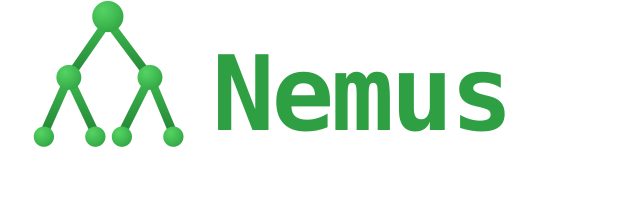

<p align="center">
  
</p>

<p align="center">
  <b>Work on many Git repos as if they were one project.</b><br/>
  Nemus pulls the repos you're working on into a single folder, runs commands across
  all of them at once, and gives your AI coding agent the whole picture.
</p>

<p align="center">
  <a href="https://me-public.github.io/nemus/"></a>
  <a href="https://github.com/me-public/nemus/actions/workflows/ci.yml"></a>
  <a href="https://www.npmjs.com/package/@nemus-cli/nemus"></a>
  <a href="LICENSE"></a>
  <a href="https://www.npmjs.com/package/@nemus-cli/nemus"></a>
  = 22.13" />
  <a href="https://x.com/nemus_cli"></a>
</p>

<p align="center">
  🌐 <b><a href="https://me-public.github.io/nemus/">me-public.github.io/nemus</a></b> &nbsp;—&nbsp; 📦 <b><a href="https://www.npmjs.com/package/@nemus-cli/nemus">@nemus-cli/nemus</a></b> on npm &nbsp;—&nbsp; 𝕏 <b><a href="https://x.com/nemus_cli">@nemus_cli</a></b> &nbsp;—&nbsp; <code>npm install -g @nemus-cli/nemus</code>
</p>

<p align="center">
  <a href="https://raw.githubusercontent.com/me-public/nemus/main/docs/assets/nemus-cli-demo.mp4"></a>
</p>
<p align="center"><sub>A real recording — <code>nemus -- "…"</code> turns a sentence into a ready workspace. <a href="https://raw.githubusercontent.com/me-public/nemus/main/docs/assets/nemus-cli-demo.mp4">▶ watch as MP4</a></sub></p>

---

## What is Nemus?

Your product's code is probably split across **many separate Git repos** — frontend,
backend, auth, payments, shared libraries. Working on one feature means cloning,
pulling, branching, and testing each repo by hand, one at a time — and your AI coding
agent only ever sees the single repo you happened to open.

**Nemus lets you pull the repos you're working on into one folder and treat them as a
single project:**

- **One command clones them all** — and keeps them in sync.
- **Run any git or shell command across every repo at once** — `status`, `pull`,
  `branch`, `npm test`, anything.
- **Your AI agent sees the whole set at once** — so a prompt like *"add idempotency
  keys to the payments flow"* works even when that flow spans five repos, not one.

> **In short:** a **monorepo-style workflow across your many repos — without merging them.**

### Before vs. after

**Without Nemus** — clone each repo by hand, `cd` into every one, pull, branch, run
tests, and repeat. Your agent only sees whichever repo you opened.

**With Nemus:**

```bash
nemus create -w payments -r api,web,ledger,gateway,workers   # clone all 5 into one workspace
nemus run payments "npm test"                                # run the tests in all 5 at once
nemus -- "add idempotency keys to the payments flow"         # let an agent work across all 5
```

> Prefer to point-and-pick? Just run `nemus create` for an interactive repo picker with
> fuzzy search, or `nemus -- "create a workspace with the payments repos"` in plain English.

## What you get

- 🌳 **Workspaces** — group repos, clone them all in parallel, jump in.
- 🔁 **Operate in bulk** — status, sync, diff, run, branch across every repo.
- 📦 **Suites & snapshots** — save reusable repo collections and exact states.
- 🤖 **Agent-native** — first-class integration with multiple coding agents
  (Claude Code, pi, OpenCode, Codex, Gemini) via context files, skills, and an MCP server.
- 🩺 **Healthy by default** — health checks, dependency analysis, retries.

## The name

**Nemus** (_NEH-mus_) is Latin for a **grove** — a small wood of trees sharing
soil and roots. It's a fitting picture of what the tool manages: a cluster of
repositories, each its own tree, growing together in one workspace. It also nods
to the branch-and-commit shape of Git itself.

## A full clone per workspace — on purpose

This is the core design decision, so it's worth being explicit: **every workspace
gets its own independent, full `git clone` of each repo.** Two workspaces that both
contain `api` hold two separate clones — each with its own `.git`, index, stash,
hooks, config, branches, and build artifacts.

A reasonable question is *"why not `git worktree`?"* Worktrees attach multiple
working directories to **one shared repository**, which is great for flipping
between branches of a **single** repo. But Nemus is built for **many repos worked
on in parallel — often by AI agents — at the same time**, and there full clones win:

| | **Nemus: clone per workspace** | **`git worktree`** |
|---|---|---|
| **Scope** | Spans **many repos** per workspace uniformly | A **single-repo** feature (`git worktree add` lives inside one repo) |
| **Isolation** | Total: separate `.git`, index, stash, config, **hooks**, and build outputs (`node_modules/`, `target/`, `dist/`) | Partial: worktrees **share** the object store, config, and hooks |
| **Same branch, twice** | ✅ Two workspaces can both sit on `main` (e.g. stable vs. experiment) | ❌ Git refuses to check out the same branch in two worktrees |
| **Parallel agents** | Safe: one agent's rebase/branch-switch/`gc`/dirty tree can't touch another's | Risky: aggressive concurrent ops share one object DB + refs |
| **Per-workspace remotes/creds** | ✅ Each clone can point at a different fork/remote | ❌ Remotes are shared |
| **Disposable** | It's just a directory — `rm -rf` is safe | Needs `git worktree remove`; a stale/broken worktree can corrupt the parent's list |
| **Tooling** | Every dir is a normal repo — IDEs, scripts, and git tools "just work" | Some tools mishandle the `.git`-file pointer / shared hooks |

**The honest trade-off:** full clones use more disk and take longer to set up than a
worktree that shares the object store. Nemus leans into that on purpose and softens
it — clones run **in parallel**, retry on flaky networks, and the repo list is
cached. For juggling many repos across several workspaces (and several agents), the
bulletproof isolation is worth the extra gigabytes. If you're switching branches
within one repo, plain `git worktree` is still the right tool — Nemus solves the
different problem of *many* repos in *many* independent workspaces.

## Quick Start

```bash
# Install globally
npm install -g @nemus-cli/nemus

# One-time setup (choose your GitHub org, agent, clone protocol…)
nemus configure

# Create your first workspace (interactive repo picker with fuzzy search)
nemus create

# Or let an agent do it — describe what you need in plain English
nemus -- create a workspace with all payments-related repos
```

After creation you're dropped into the workspace directory with all repos cloned.

> `nemus` and the shorter `nem` are equivalent. Use whichever you like.

## Installation

### From npm (recommended)

```bash
npm install -g @nemus-cli/nemus
```

The postinstall step sets up optional shell integration (auto-cd into new
workspaces + a quick-navigate helper).

### From source

```bash
git clone https://github.com/me-public/nemus.git
cd nemus
npm install
npm run build
npm link   # makes `nemus` / `nem` available on your PATH
```

### Prerequisites

- **Node.js 22.13+** (the prompt library loads via `require(esm)`)
- Git
- [GitHub CLI](https://cli.github.com/) (`gh`), authenticated via `gh auth login`
- SSH keys configured for GitHub (recommended; HTTPS also supported)

## Connecting AI agents

Nemus is agent-agnostic. It detects installed agent CLIs and, for each active
agent, writes the right context file, installs skills, and (where supported)
registers its MCP server and hooks.

| Agent | CLI | Context file | MCP | Notes |
|-------|-----|--------------|-----|-------|
| **Claude Code** | `claude` | `CLAUDE.md` | ✅ | Hooks + status line supported |
| **pi** | `pi` | `AGENTS.md` | — | |
| **OpenCode** | `opencode` | `AGENTS.md` | ✅ | Reads `~/.claude/skills` natively |
| **Codex** (OpenAI) | `codex` | `AGENTS.md` | ✅ | Reads `~/.codex/config.toml` |
| **Gemini** (Google) | `gemini` | `GEMINI.md` | ✅ | |

Choose your agent(s) during `nemus configure`, or set them any time:

```bash
nemus configure          # interactive
# aiAgent:      claude | pi | opencode | codex | gemini | both | auto
# primaryAgent: claude | pi | opencode | codex | gemini | auto
```

- `auto` detects installed CLIs and picks sensibly.
- `both` means **every** installed agent (context files + skills written for all).

### Model providers

The agent CLIs own model/provider auth, so Nemus works with **any provider your
agent supports** — Anthropic, OpenAI, Google, or **Amazon Bedrock** — with no extra
configuration in Nemus. For example, Claude Code and pi both run against Bedrock via
their own environment (`CLAUDE_CODE_USE_BEDROCK=1`, or pi's `amazon-bedrock`
provider); Codex and Gemini authenticate to OpenAI and Google respectively. Point
your agent at whichever provider you like — Nemus just drives the agent.

## Usage

Every command has a short alias (shown in parentheses).

### Create & manage workspaces

```bash
nemus create           # (c) interactive create
nemus list             # (l) list workspaces
nemus update           # (u) add repos to a workspace
nemus delete           # (del) delete a workspace
nemus go [name]        # jump to a workspace directory
```

### Operate across all repos

```bash
nemus status my-workspace     # (st) git status for every repo
nemus sync my-workspace       # (s) git pull every repo (auto-retries on flaky network)
nemus diff my-workspace       # (d) combined diff summary  (--full for raw diffs)
nemus run my-workspace "npm install"   # (r) run a command in every repo
nemus doctor my-workspace     # (doc) health checks + score
```

```
Repo             Branch       Status        Ahead/Behind   Modified
─────────────────────────────────────────────────────────────────────
api              main         ✓ Clean       Up to date     -
web              feature/x    ⚠ 2 modified  ↑1             2 files
shared-lib       main         ✓ Clean       ↓3             -
```

### Scripting: `--json`

The read-only reporting commands accept `--json` for stable, machine-readable
output: `list`, `status`, `doctor`, `suite list`, `sessions`, and
`analyze-deps`. Diagnostics go to stderr, so stdout is a single JSON document
you can pipe straight into `jq` or a CI step:

```bash
nemus list --json | jq -r '.workspaces[].name'
nemus status my-workspace --json | jq '.clean'
nemus doctor my-workspace --json | jq '.score'
nemus suite list --json | jq -r '.suites[].name'
nemus sessions --json | jq -r '.sessions[].workspaceName'
nemus analyze-deps my-workspace --json | jq '.circularDependencies'
```

The workspace-scoped ones (`status`/`doctor`/`analyze-deps`) need an explicit
workspace name with `--json` (they never prompt). On failure, `--json` prints a
parseable `{ "ok": false, "error": … }` to stdout and exits non-zero.

### Configuration

Run `nemus configure` for the interactive wizard, or manage settings
non-interactively (handy for scripts and dotfiles):

```bash
nemus config list                     # all keys, values, and descriptions
nemus config get cloneProtocol        # print one value (raw, for scripts)
nemus config set cloneProtocol https  # validated + coerced per key
nemus config set autoReportBugs yes   # booleans accept true/false/yes/no/on/off/1/0
nemus config unset githubOrg          # reset a key to its default
nemus config path                     # print the config file location
```

`get`/`list` also accept `--json`. An unknown key or an invalid value exits
non-zero with a clear message (e.g. `cloneProtocol must be one of: ssh, https`).
`config edit` opens the file in `$VISUAL`/`$EDITOR` (seeding it with the current
resolved config first) and re-validates the JSON afterward.

### Environment variables

Everything Nemus reads from the environment (all optional):

| Variable | Effect |
| --- | --- |
| `NEMUS_DIR` | Override where workspaces are created (also `WORKSPACE_MANAGER_DIR`). |
| `NEMUS_CACHE_DIR` | Override the cache/config/state dir, default `~/.nemus` (also `WORKSPACE_MANAGER_CACHE_DIR`). |
| `NEMUS_JUDGE_MODEL` | Model for the `reflect` judge (overrides `--model`'s default). |
| `NEMUS_JUDGE_THINKING` | Thinking level for the `reflect` judge on pi (`off`…`max`). |
| `NEMUS_JUDGE_TIMEOUT_MS` | Timeout for the `reflect` judge call. |
| `NEMUS_BUG_REPORT_REPO` | Repo that `report-bug` files issues against. |
| `NEMUS_SKIP_CONFIGURE` | Skip the one-time post-install `configure` prompt. |
| `WORKSPACE_CLONE_TIMEOUT_MS` | Git clone timeout (default 15 min). |
| `NO_COLOR` / `FORCE_COLOR` | Disable / force ANSI color (see [Global flags](#global-flags)). |
| `VISUAL` / `EDITOR` | Editor launched by `nemus config edit`. |

### Global flags

- `--no-color` — disable ANSI color. Nemus also honors the standard
  [`NO_COLOR`](https://no-color.org) env var and auto-disables color when stdout
  isn't a TTY (piped/redirected); `FORCE_COLOR=1` forces it on.
- `-q, --quiet` — suppress routine progress logs (info/success/step) while still
  showing warnings and errors. Data (including `--json`) is unaffected.

### Shell completions

Tab-complete subcommands and workspace names. `nemus completion <shell>` prints
a script for `bash`, `zsh`, or `fish` (works for both the `nemus` and `nem`
binaries):

```bash
# bash
nemus completion bash > /etc/bash_completion.d/nemus     # or >> ~/.bashrc
# zsh (a directory on your $fpath)
nemus completion zsh > "${fpath[1]}/_nemus"
# fish
nemus completion fish > ~/.config/fish/completions/nemus.fish
```

Workspace names are resolved live (the script calls back into the CLI), so they
stay current without regenerating.

### Suites (reusable repo collections)

```bash
nemus suite create            # (sc) save a set of repos (+ optional post-clone hooks)
nemus suite list              # (sls)
nemus suite use               # (fs) create a workspace from a suite
nemus suite export my-suite -o my-suite.json
nemus suite import my-suite.json
```

### Branches & snapshots

```bash
nemus branch switch           # (sb) switch every repo to a branch
nemus branch create ws feature/new-thing   # (bc)
nemus snapshot save ws        # (ss) capture exact branches/commits/dirty state
nemus snapshot restore <id>   # (sr)
```

### Reflect — improve your setup over time

```bash
nemus reflect                 # (retro) analyze your last 10 workspaces' sessions
nemus reflect --limit 5       # narrow the window
nemus reflect --json          # structured report for tooling
nemus reflect --markdown      # Markdown report (grouped by severity) to paste/save
nemus reflect --group-by kind # group recommendations by kind instead of priority
nemus reflect --dry-run       # show what the judge sees, without calling the agent
```

`--markdown` writes a clean, severity-grouped report to stdout — pipe it into a
file or an issue: `nemus reflect --markdown > reflection.md`. `--group-by
kind|priority` (default `priority`) controls how recommendations are grouped in
both the human and Markdown output.

Every run is saved under `~/.nemus/reflect/`. Review past reports without
re-running the judge:

```bash
nemus reflect history            # list saved reports, newest first (--json)
nemus reflect show               # print the latest saved report
nemus reflect show <id>          # a specific one (--markdown / --json / --group-by)
```

`reflect` reads your recent agent **session transcripts** (Claude + pi), distills
the prompts you sent, the failures the agent hit, and the tools it used, then asks
**your own configured agent** (LLM-as-a-judge — no extra API key) to recommend
concrete improvements: which **skills** to add and where, missing
**AGENTS.md/context** rules, missing **connectivity/smoke tests**, and
**prompt/workflow** habits — each with a priority and an example snippet. It's a
fast retrospective on *how you drive the agent*, so next time works better.

### AI assistant

```bash
nemus -- create a workspace for the payments team
nemus -- list my workspaces and show their status

# Investigate-first: create an EMPTY workspace and let the agent discover the repos
nemus -- search the logs for the OCR 500s, find the services in the trace, and open those repos
```

**Investigate-first workspaces:** when your prompt doesn't name concrete repos but
asks the agent to *figure out* which repos are relevant (from a trace, a stack
trace, or a log search), Nemus creates an **empty** workspace and hands the agent a
discover-then-add workflow: it investigates, maps the services it finds to repos
(fuzzy `search-repos`, or the `gh` CLI), adds them with `nemus update`, and only
then digs into the code.

Nemus exposes an **MCP server** (`nemus-mcp`) so MCP-capable agents can search
repos, create/update workspaces, check status, and more directly from a prompt.

Run `nemus --help` for the full command reference.

## Cloud (optional, self-hosted)

Nemus is **local-first** — everything above runs entirely on your machine. If you
want to hand a task to an agent that runs **headlessly on infrastructure you own**
(local Docker, AWS Fargate, or any Kubernetes cluster) and opens a PR for you,
there's an **optional, opt-in** package: [`@nemus-cli/cloud`](./packages/cloud).

It's a separate, vendor-neutral package built from swappable seams — runners
(`docker`, `aws-fargate`, `kubernetes`), IaC provisioners (OpenTofu/Terraform
modules), git forges (GitHub/GitLab), a bounded CI-fix loop, and notifiers — with
no cloud SDK in the core CLI. It's published separately as **experimental**
(`0.x`), so installing the core CLI pulls in none of it:

```bash
npm install -g @nemus-cli/cloud
```

See [`packages/cloud/README.md`](./packages/cloud/README.md) to get started.

## Configuration

`nemus configure` writes `~/.nemus/config.json`. Environment
variables override it:

```bash
export NEMUS_DIR="$HOME/my-workspaces"        # default: ~/workspaces
export NEMUS_CACHE_DIR="$HOME/.cache/nemus"   # default: ~/.nemus
```

(The legacy `WORKSPACE_MANAGER_DIR` / `WORKSPACE_MANAGER_CACHE_DIR` names still
work as fallbacks. On first run, state from the old `~/.workspace-manager-cache`
location is migrated to `~/.nemus` automatically.)

Key settings: `githubOrg` (which org's repos to list — leave empty to list your
own), `cloneProtocol` (`ssh`|`https`), `aiAgent`, `primaryAgent`, `installMcp`.

## Workspace layout

```
~/workspaces/
└── my-workspace/
    ├── .workspace-meta.json    # repos, timestamps, health
    ├── AGENTS.md / CLAUDE.md    # generated agent context
    ├── api/                     # cloned repos
    ├── web/
    └── shared-lib/
```

## Development

```bash
npm run build        # compile TypeScript
npm test             # run the test suite (vitest)
npm run typecheck    # tsc --noEmit
npm link             # use your local build globally
```

See [CONTRIBUTING.md](CONTRIBUTING.md) for guidelines and
[docs/architecture.md](docs/architecture.md) for a tour of the codebase.

## Releasing

Releases are automated and gated by a manual approval. Bump the version, merge to
`main`, and approve the deployment — see [docs/releasing.md](docs/releasing.md).

## Contributing

Contributions are welcome! Please read [CONTRIBUTING.md](CONTRIBUTING.md) and our
[Code of Conduct](CODE_OF_CONDUCT.md). Security issues: see [SECURITY.md](SECURITY.md).

## License

[MIT](LICENSE) © Nemus contributors
